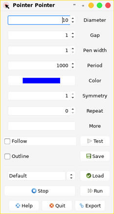

# POINTERPOINTER

PointerPointer is a self-contained shell script that configures and launches one or more pointers to the mouse pointer.
What's the point? You could use a pointer pointer to find your mouse pointer on the screen. You could also use a trail of pointer pointers to highlight the pointer as it moves - this can be useful with some remote meeting and presentation applications that don't display the mouse pointer correctly.  But ultimately, pointer pointer is mostly a fun gadget.

## DEPENDENCIES

* yad (GTK+ dialog maker) - the version forked at [:1](#LINKS)
* find-cursor (draw circles at the mouse position) - the version forked at [:2](#LINKS)

## SCREENSHOT

## AUTHOR

step

## CREDITS

* Victor Ananjevsky for the original yad[:3](#LINKS)
* Martin Tournoij for the original find-cursor[:4](#LINKS)

<a name="LINKS">

## LINKS

**Homepage**
[github.com/step-/pointerpointer](https://github.com/step-/pointerpointer)

**:1** yad from the GTK+ 2 maintainance branch "maintain-gtk2" commit 350ab23 or newer
[https://github.com/step-/yad](https://github.com/step-/yad)

**:2** find-cursor from branch "pointerpointer" commit a26bc75 or newer
[https://github.com/step-/find-cursor](https://github.com/step-/find-cursor)

**:3** the original yad - now a GTK+ 3 only application
[https://github.com/v1cont/yad](https://github.com/v1cont/yad)

**:4** the original find-cursor
[https://github.com/arp242/find-cursor](https://github.com/arp242/find-cursor)

